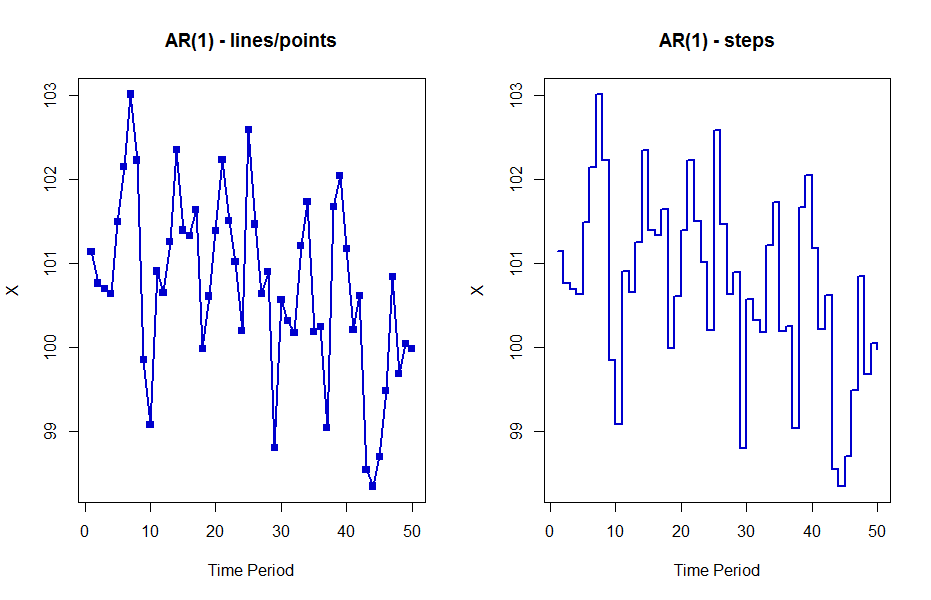
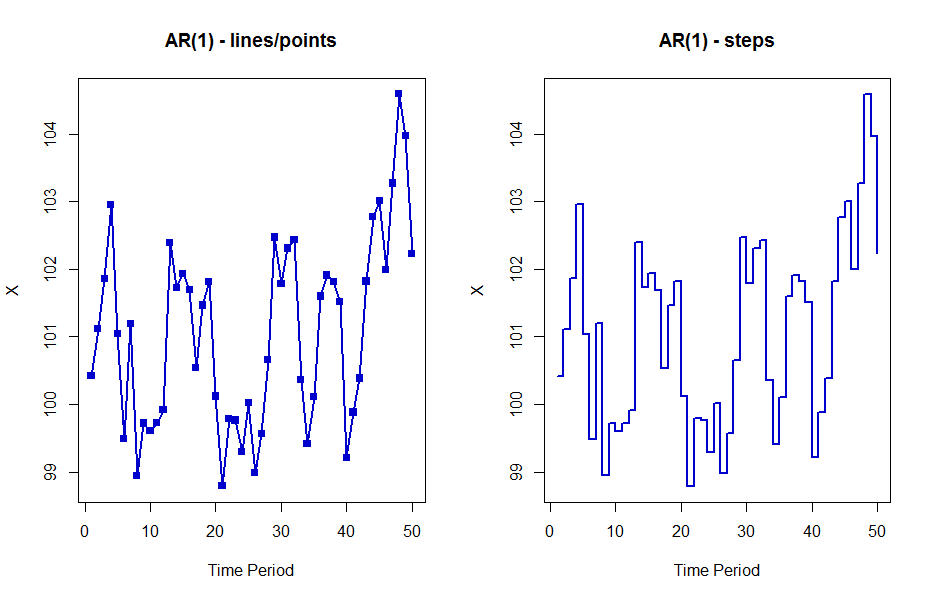

[](http://quantlet.de/index.php?p=info)

## [](http://quantlet.de/) **ar1_process** [](http://quantlet.de/d3/ia)

```yaml

Name of Quantlet : ar1_process

Published in : Stochastic processes

Description : 'Simulates the path of a First-order autoregressive (AR-1) process over 50 time
points. Epsilon terms/innovations are normally distributed - N(0,1). Model: X_t = 100 + r(X_t-1 -
100) + e_t. Mean reverting to 100, 0 < r < 1.'

Keywords : 'autoregressive, normal-distribution, plot, random, random-number-generation,
simulation, standard-normal, stochastic-process, time-series'

See also : random_walk, randomwalk_ar1

Author : Lukas Borke

Submitted : Fri, May 29 2015 by Lukas Borke

Input: 
- N: number of simulated time points
- StartVal: Starting value for X_0
- rho: First AR-parameter (rho * X_t-1)

Example: 
- 1: Realized AR(1) path - number 1, rho = 0.8
- 2: Realized AR(1) path - number 2, rho = 0.8

```






### R Code:
```r

N			= 50
StartVal	= 100

rho = 0.8

randomE	= rnorm(N, 0, 1)

# AR 1 - mean reverted
ar1 = rep(0, N + 1)
# first element is the starting value
ar1[1] = StartVal

for (t in 2:(N + 1)) {
	ar1[t] = rho * ar1[t - 1] + StartVal * (1 - rho) + randomE[t-1]
}

# discard the starting value and keep X1,...,X_N
ar1 = ar1[-1]

# Plotting two types
par(mfrow=c(1,2))

plot(1:N, ar1, type = "o", col = "blue3", lwd = 2, ylab = "X", xlab = "Time Period", main = "AR(1) - lines/points", pch=15)
plot(1:N, ar1, type = "s", col = "blue3", lwd = 2, ylab = "X", xlab = "Time Period", main = "AR(1) - steps")

```
