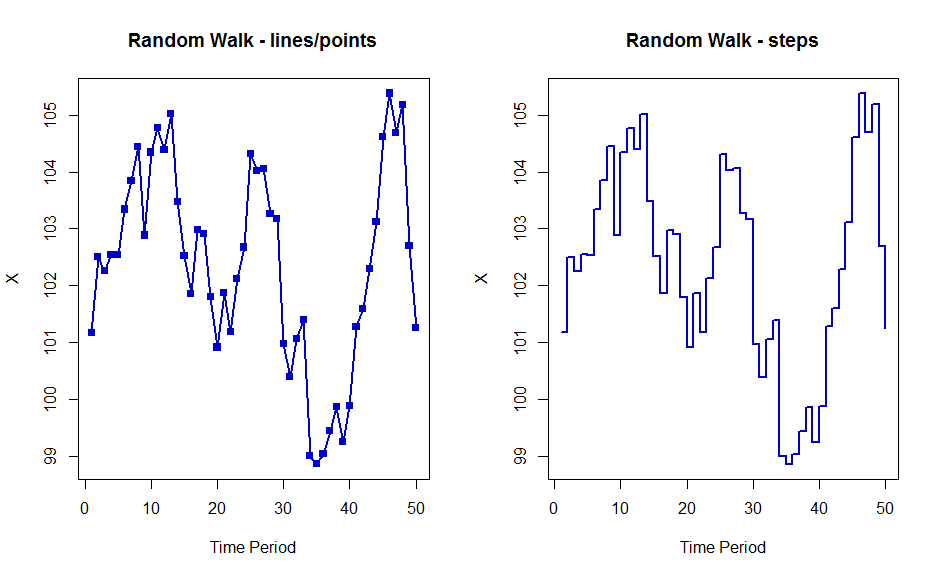
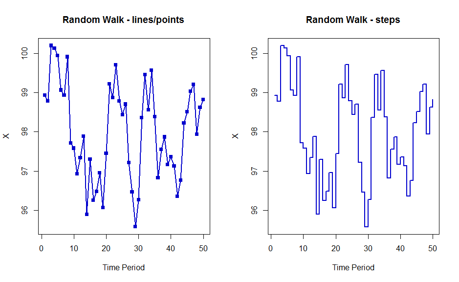

[](http://quantlet.de/index.php?p=info)

## [](http://quantlet.de/) **random_walk** [](http://quantlet.de/d3/ia)

```yaml

Name of Quantlet : random_walk

Published in : Stochastic processes

Description : 'Simulates the path of a random walk over 50 time points. Epsilon terms/innovations
are normally distributed - N(0,1).'

Keywords : 'normal-distribution, plot, random, random-number-generation, random-walk, simulation,
standard-normal, stochastic-process, time-series'

See also : ar1_process, randomwalk_ar1

Author : Lukas Borke

Submitted : Fri, May 29 2015 by Lukas Borke

Input: 
- N: number of simulated time points
- StartVal: Starting value for X_0

Example: 
- 1: Realized path number 1
- 2: Realized path number 2

```






### R Code:
```r

N			= 50
StartVal	= 100

randomE	= rnorm(N, 0, 1)

# Random Walk
RandomWalk = cumsum(randomE) + StartVal

# Plotting two types
par(mfrow=c(1,2))

plot(1:N, RandomWalk, type = "o", col = "blue3", lwd = 2, ylab = "X", xlab = "Time Period", main = "Random Walk - lines/points", pch=15)
plot(1:N, RandomWalk, type = "s", col = "blue3", lwd = 2, ylab = "X", xlab = "Time Period", main = "Random Walk - steps")

```
