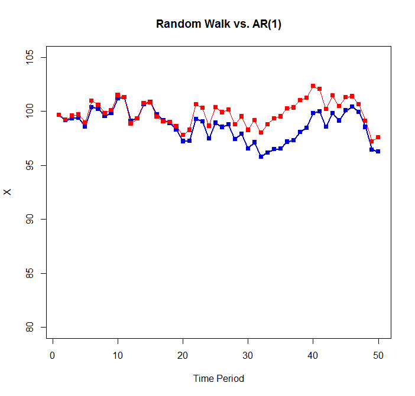
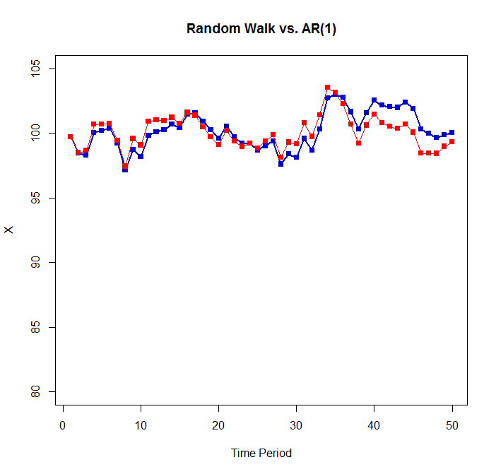
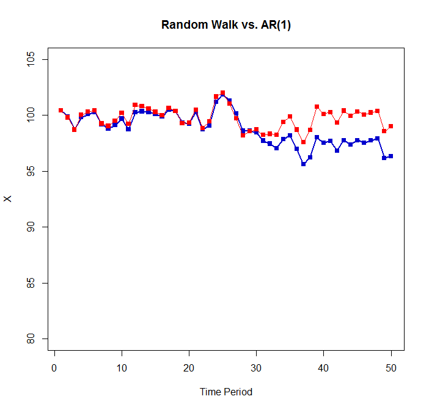
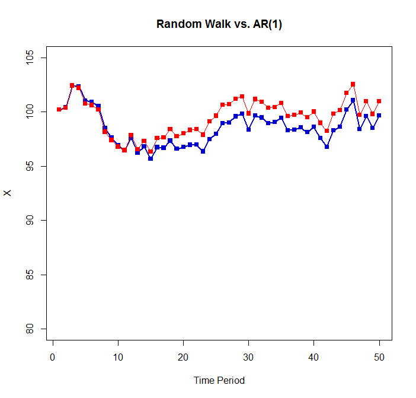
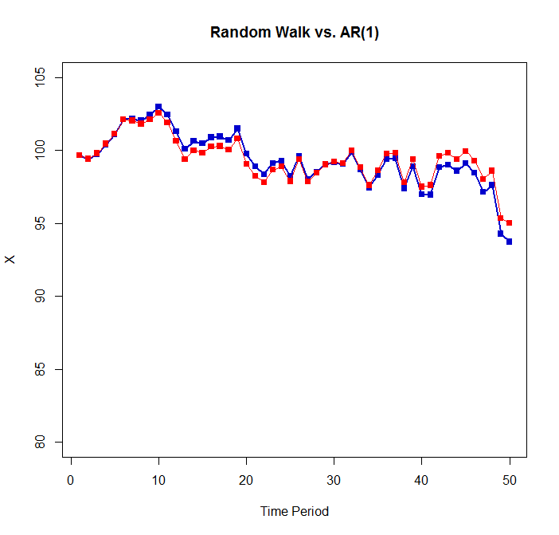

[](http://quantlet.de/index.php?p=info)

## [](http://quantlet.de/) **randomwalk_ar1** [](http://quantlet.de/d3/ia)

```yaml

Name of Quantlet : randomwalk_ar1

Published in : Stochastic processes

Description : 'Similarity of both random walk and AR-1 (autoregressive process) to actual stock
prices. The blue path is a random walk over 50 time points. The red path is a First-order
autoregressive (AR-1) process over 50 time points. Model: X_t = 100 + r(X_t-1 - 100) + e_t. Mean
reverting to 100, 0 < r < 1. In each case epsilon terms/innovations are normally distributed -
N(0,1).'

Keywords : 'approximation, autoregressive, normal-distribution, plot, random,
random-number-generation, random-walk, similarity, simulation, standard-normal, stochastic-process,
time-series'

See also : ar1_process, random_walk

Author : Lukas Borke

Submitted : Wed, June 03 2015 by Lukas Borke

Input: 
- FALSE: number of simulated time points
- StartVal: Starting value for X_0
- rho: First AR-parameter (rho * X_t-1)

Example: 
- 1: 'Realized path for the random walk and AR(1) : simulation 1, rho = 0.8'
- 2: 'Realized path for the random walk and AR(1) : simulation 2, rho = 0.8'
- 3: 'Realized path for the random walk and AR(1) : simulation 3, rho = 0.8'
- 4: 'Realized path for the random walk and AR(1) : simulation 1, rho = 0.95'
- 5: 'Realized path for the random walk and AR(1) : simulation 2, rho = 0.95'
- 6: 'Realized path for the random walk and AR(1) : simulation 3, rho = 0.95'

```












### R Code:
```r

N			= 50
StartVal	= 100

# rho 		= 0.95
rho 		= 0.8

randomE		= rnorm(N, 0, 1)

# Random Walk
RandomWalk	= cumsum(randomE) + StartVal

# AR 1 - mean reverted
ar1 	= rep(0, N + 1)
ar1[1] 	= StartVal

for (t in 2:(N + 1)) {
	ar1[t] = rho * ar1[t - 1] + StartVal * (1 - rho) + randomE[t-1]
}

ar1 = ar1[-1]

# Plot Random Walk + AR 1
plot(1:N, RandomWalk, type = "o", col = "blue3", lwd = 2, ylab = "X", xlab = "Time Period",
	main = "Random Walk vs. AR(1)", pch=15, , ylim=c(80,105))
lines(1:N, ar1, type = "o", col = "red", pch=15)

```
